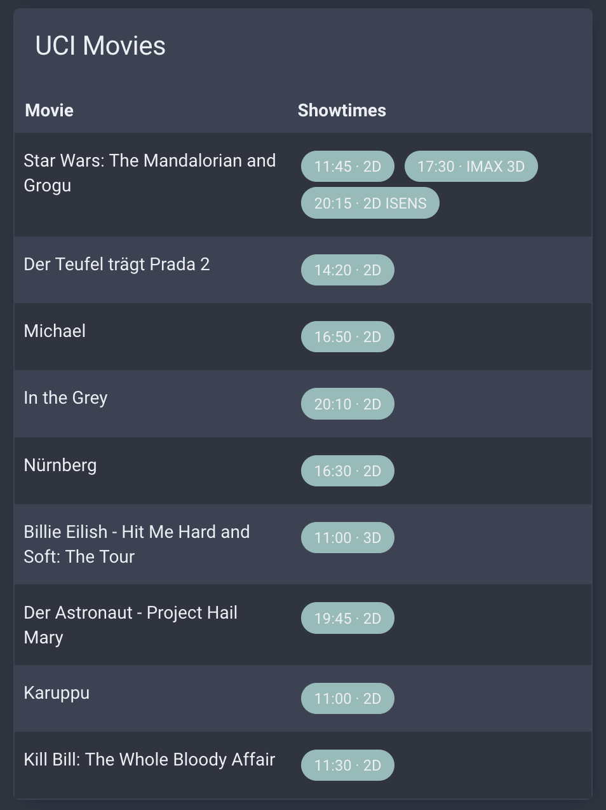

# UCI Kinowelt Showtimes for Home Assistant

A Home Assistant custom integration that scrapes OV (Original Version) and OmU (Original with subtitles) showtimes from [UCI Kinowelt](https://www.uci-kinowelt.de/) cinemas in Germany.



## Features

- Fetches OV/OmU showtimes for any UCI Kinowelt cinema
- Creates a sensor entity with movie data as attributes
- Updates every 2 hours
- Shows screening format (IMAX, 3D, ScreenX, etc.)

## Installation via HACS (Custom Repository)

1. Open HACS in your Home Assistant instance
2. Click the three dots menu in the top right
3. Select **Custom repositories**
4. Add this repository URL: `https://github.com/melzareix/uci-homeassistant`
5. Category: **Integration**
6. Click **Add**
7. Search for "UCI Kinowelt" in HACS and install it
8. Restart Home Assistant

## Configuration

1. Go to **Settings > Devices & Services > Add Integration**
2. Search for "UCI Kinowelt"
3. Enter the cinema slug and ID from the UCI website URL

For example, from `https://www.uci-kinowelt.de/kinoprogramm/berlin-east-side-gallery/82/list`:
- Cinema slug: `berlin-east-side-gallery`
- Cinema ID: `82`

## Dashboard Card

This integration works well with [flex-table-card](https://github.com/custom-cards/flex-table-card). Install it via HACS, then add this card:

```yaml
type: custom:flex-table-card
title: OV Showtimes Today
entities:
  include: sensor.uci_berlin_east_side_gallery_ov_showtimes
columns:
  - name: Movie
    data: movies
    modify: x.title
  - name: Showtimes
    data: movies
    modify: |-
      x.showtimes.map(st => {
        let tags = st.tags.filter(t => !['OV','OMU','OMEU'].includes(t));
        let label = st.time + (tags.length ? ' · ' + tags.join(' ') : '');
        return '<span style="display:inline-block;padding:4px 10px;margin:4px;border-radius:16px;background:var(--primary-color);color:var(--text-primary-color);font-size:0.85em">' + label + '</span>';
      }).join('')
css:
  table+: "border-collapse: collapse; width: 100%;"
  td+: "padding: 12px 8px; vertical-align: top;"
  th+: "padding: 8px; text-align: left;"
```

## Sensor Data

The sensor provides:
- **State**: Number of movies with OV/OmU screenings today
- **Attributes**:
  - `movies`: List of movies, each with `title` and `showtimes` (array of `{time, tags}`)
  - `date`: Current date (ISO format)
